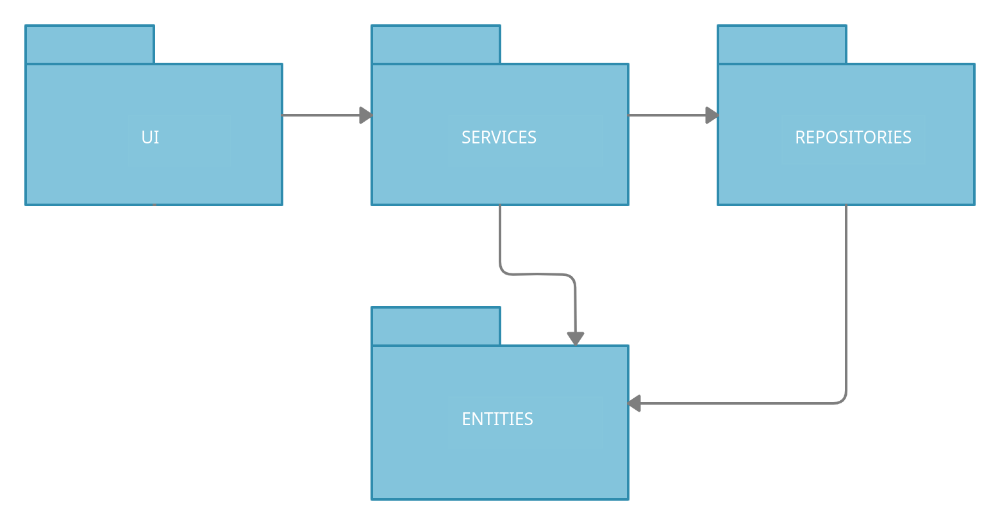
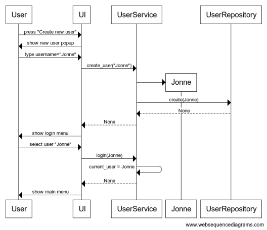

# Arkkitehtuurikuvaus

## Ohjelman rakenne

Ohjelman rakenne on seuraavanlainen:

Käyttöliittymästä vastaa pakkaus _ui_, sovellulogiikasta vastaa pakkaus _services_, tiedon tallentamisesta tietokantaan vastaa _repositories_ pakkaus ja viimeiseksi pakkauksen _entities_ luokat kuvastavat sovelluksen tietokantaan tallennettavia kohteita. 

## Käyttöliittymä

Käyttöliittymä koostuu kolmesta erilaisesta näkymästä: 

- Valikot
- Ponnahdusikkunat
- Pelinäkymä

Ne on toteutettu omina luokkinaan ja osaluokkinaan. Sudokua ratkaistessa ollaan pelinäkymässä ja yleensä muuten ollaan valikoissa. Aina välillä kun halutaan infota pelaajalla jotakin, niin joko valikko- tai pelinäkymän päälle piirretään ponnahdusikkuna, joka kertoo lisätietoa jostakin asiasta. 

## Tiedon tallentaminen tietokantaan

Sovelluksen tietokohteiden luokkakaavio:

### Tiedostot

Sovelluksen data tallennetaan erilliseen SQLite-tietokantaan. Tämä tietokanta alustetaan sovelluksen alustusvaiheiseessa. Myös testejä varten on erillinen SQLite-tietokanta testaamista varten. 

## Sovelluslogiikka

Käyttäjän luomisen ja kirjautumisen sekvenssikaavio:

