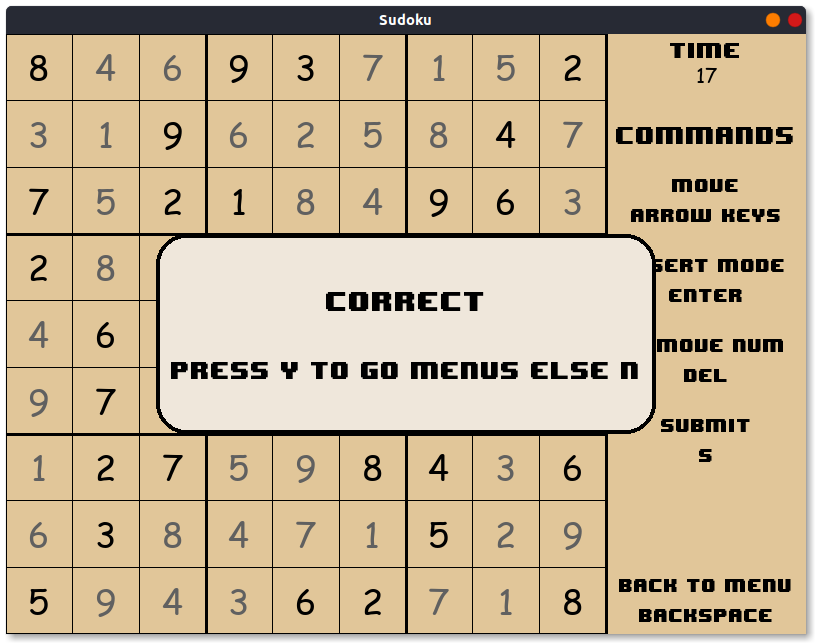
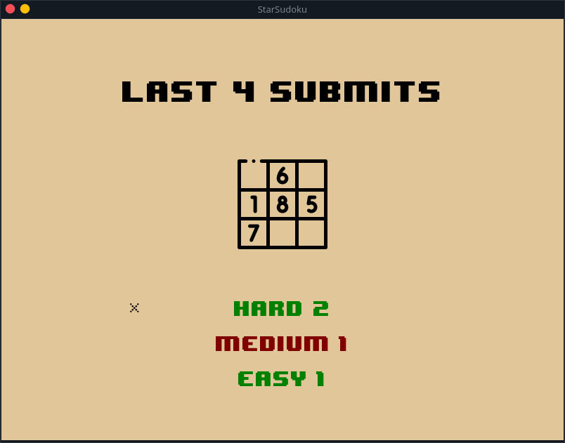

# Käyttöohje

## Navigointi

Sovelluksen valikoiden välillä voi liikkua nuolinäppäimillä. Alavalikkoon pääsee painamalla ENTER-näppäintä ja takaisin pääsee painamalla BACKSPACE-näppäintä. Sudokun ratkaisu tilassa ohjeet näkyvät oikealla puolella ikkunaa. 

## Kirjautuminen

Sovellus käynnistyy kirjautumisnäkymään. Aluksi käyttäjän tulee tehdä uusi käyttäjä: 

Sitten valikkoon ilmestyy uusi käyttäjä ja sen valitsemalla päästään päävalikkoon:

## Sudokujen ratkaiseminen

Päävalikosta on kehitetty vasta ratkaisutoiminnallisuus, joten jos käyttäjä menee valitsemaan sudokun, niin hän lopulta pääsee sudokun ratkaisuun: 

Oikealle olevia ohjeita noudattamalla voidaan ratkaista sudokua: 

Kun käyttäjä on täyttänyt sudokun, voi hän tarkastaa vastauksen painamalla `s` eli submittaamalla. 

## Ratkaisu historia katsominen

Käyttäjä voi päästä päävalikosta historia näkymään. Siellä näkyy 4 viimeisintä ratkaisua, joista ylimmäinen on viimeisin. Vihreä väri tarkoittaa, että ratkaisu oli oikein ja punainen että ratkaisu oli väärin. Painamalla enter-näppäintä voidaan nähdä vähäsen lisätietoa ratkaisusta (ratkaisu aika)

