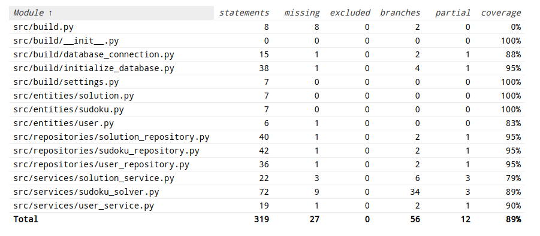

# Testausdokumentti

Ohjelmaa on testattu yksikkö- ja integraatiotesteillä käyttäen Pythonin unittestia. Lisäksi järjestelmätason testejä on suoritettu manuaalisesti sovelluksen luojan toimesta. Jos löydät bugeja sovelluksesta, pyytäisin laittamaan github issuen niin saadaan se korjattua. 

## Yksikkö- ja integraatiotestaus

### Sovelluslogiikka

Sovelluslogiikasta vastaa _service_ pakkauksen luokat. Pakkauksen luokat alustetaan ja niille injektoidaan riippuvuuksiksi repositorio-olit, jotka tallentavat tietoa testausta varten luotuun erilliseen SQLite-tietokantaan. 

### Repositorio-luokat

Tiedontallentamisesta vastaavat _repositories_ pakkauksen luokat. Suurinta osaa luokkien metodeista testataan sekä tiedontallentaminen tapahtuu testausta varten luotuun erilliseen SQLite-tietokantaa. 

### Testauskattavuus

Käyttöliittymäkerrosta ei olla testattu, mutta muuten sovelluksen haarautumakattavuus on lähelle 90%.

## Järjestelmätestaus

Järjestelmätestaus on tehty manuaalisesti. Aluksi sovellus ollaan asennettu, alustettu ja käynnistetty Linux-koneella. Sitten sovellusta on testattu kaikilla mahdollisilla keinoilla yrittäen löytää mahdollisia bugeja ja katsomaan, että halutut toiminnallisuudet toimivat niin kuin pitää. Tällä hetkellä kaiken pitäisi toimia ilman mitään ongelmia. 